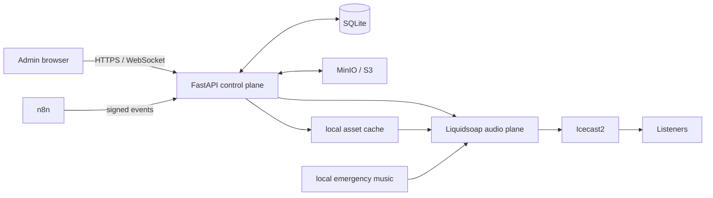
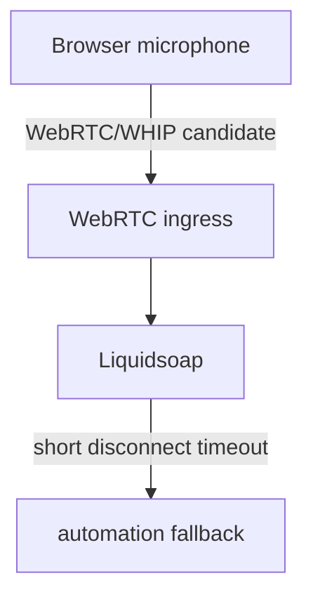

# Architecture

ICEux separates control from audio so the broadcaster remains useful during application, AI, storage, or UI failures.

## Decisions

**DECISION:** Liquidsoap owns every last-resort music source, including a local emergency playlist.

**REASON:** FastAPI, MinIO, AI and the browser are secondary services and may fail independently.

**TRADEOFF:** Application state can briefly differ from what is audible; reconciliation is preferable to silence.

**DECISION:** WebRTC will use a small WHIP-compatible ingress (for example MediaMTX) in Phase 6, then hand audio to Liquidsoap through a local source.

**REASON:** browser-compatible media transport without raw PCM WebSockets or a custom SFU.

**TRADEOFF:** one additional optional local service for live mode.

## Runtime responsibilities

FastAPI authenticates the sole administrator, manages SQLite metadata, arbitrates events, materializes assets into local cache, observes Icecast/Liquidsoap, and broadcasts state. SQLite stores references, never asset bytes or secrets. MinIO is durable object storage; cache prefetches current/next assets. Liquidsoap consumes only local paths, operates the queue and fallback tree, applies fades/ducking, and publishes to Icecast.

`QueueManager` persists requested work; `EventArbitrator` turns eligible events into `PLAY_QUEUE` entries based on priority and insertion behavior rather than treating priority as an unconditional interrupt. During LIVE, missed policies apply: clock/STATION ID skip, capsules reschedule, commercials play after live.

AI and TTS are replaceable providers behind services. Their outages are health warnings, never radio failures. n8n submits signed, idempotent external events. WebSockets report state; they do not control audio continuity.

## Local Compose topology

`docker compose up --build` runs FastAPI, Liquidsoap, Icecast, MinIO, a one-shot MinIO bucket initializer and Redis. Redis is included for future job/event fan-out but is not on the Phase 1 audio path and may not become a required runtime dependency. SQLite persists as `data/iceux.db`; MinIO and Redis use named volumes. Internal traffic uses service DNS names, while public ports default to app `8000`, Icecast `8001`, MinIO API `9000`, console `9001`, and Redis `6379`.

## Phase 1 scope

The first runnable slice includes environment configuration, one-admin login, a dashboard, WebSocket state updates, a local queue and a Liquidsoap control protocol. The supplied Liquidsoap script has its own automation/emergency fallback. It intentionally does not claim a working Icecast stream until valid source files and Icecast credentials are configured.
